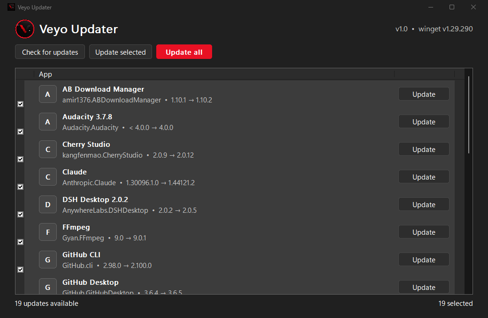

# Veyo Updater

> **Website (Home + Docs): https://mrlurix.github.io/veyo-updater/**

Portable single-file Windows updater powered by `winget`. No installation, no background services — one ~430 KB exe.



**Website:** https://mrlurix.github.io/veyo-updater/ (Home + full Docs)

## Features

- **Automatic check** — lists every package with an available `winget upgrade`, using a robust fixed-width table parser (handles long names like `Eclipse Temurin JDK…`, BOM, `\r\n`)
- **Per-app Update buttons** — Store-style rows: icon, name, `id • current → available`
- **Batch updates** — Update selected / Update all
- **Settings** — download timer (auto-start countdown), auto-check interval, and finish action (nothing / close app / shut down PC); stored portably in `VeyoUpdater.ini` next to the exe
- **Always elevated** — every upgrade runs via UAC (`runas`); cancelling shows a clear message instead of failing silently
- **Live progress** — stage (`Preparing → Downloading → Installing → Done`) + smooth percent bar + per-app counter, parsed live from the winget log
- **Animations** — fade in/out, staggered row entrance, loading spinner around the logo, fading buttons
- **Native look** — Mica title bar, rounded corners, follows the Windows light/dark theme, Segoe UI Variable
- **Portable** — settings-free, nothing written to the registry; failed-update logs stay in `%TEMP%` (`veyo-updater-*.log`)

## Download & Run

Grab `VeyoUpdater.exe` (or `VeyoUpdater_Portable.zip`) from [Releases](../../releases) and run it. Requires only Windows 10/11 with `winget` (preinstalled on Windows 11) — no VC++ Redistributable, no .NET, no other runtimes: the exe links the C runtime statically (`/MT`) and depends solely on inbox Windows DLLs.

> Updating apps asks for administrator approval (UAC) — that is intentional.

## Build from source

Requires **Visual Studio Build Tools** (MSVC + Windows SDK). Run from the project root:

```bat
"%ProgramFiles(x86)%\Microsoft Visual Studio\18\BuildTools\VC\Auxiliary\Build\vcvars64.bat"
rc /fo resources\app.res resources\app.rc
cl /utf-8 /MT /O2 /GL /EHsc /DUNICODE /D_UNICODE /Fe:VeyoUpdater.exe native\src\main.cpp resources\app.res comctl32.lib dwmapi.lib uxtheme.lib user32.lib gdi32.lib advapi32.lib shell32.lib /link /SUBSYSTEM:WINDOWS /LTCG /OPT:REF /OPT:ICF
```

Alternatives:

```powershell
# CMake (Visual Studio 2022) -> build-native/dist/VeyoUpdater.exe
cmake -S native -B build-native -G "Visual Studio 17 2022" -A x64 -DCMAKE_BUILD_TYPE=Release
cmake --build build-native --config Release --parallel

# or double-click: native\build.bat
```

`src/` additionally contains an experimental **Qt 6 Widgets** UI of the same idea (needs Qt 6.5+; see `build.ps1`). The shipped app is the native single-file build above.

## Project layout

```
VeyoUpdater.exe            # built binary (git-ignored, see Releases)
dist/                      # portable exe + zip (git-ignored)
native/src/main.cpp        # the whole native app (Win32, no dependencies)
native/CMakeLists.txt      # CMake build for the native app
native/build.bat           # one-click native build
resources/app.rc           # icon + version info + DPI/manifest
resources/app.manifest     # PerMonitorV2, UTF-8, Win10/11 support
resources/icons/veyo.ico   # multi-size app icon (from veyo-logo.png)
resources/icons/veyo-logo.png  # logo source
src/                       # experimental Qt6 UI (not required to build)
build.ps1 / pack-portable.ps1  # Qt build + portable packaging scripts
screenshot.png             # app screenshot
LICENSE                    # MIT
```

## Troubleshooting

- **`winget` not found** — update *App Installer* from the Microsoft Store, then run `winget --version`.
- **No updates listed** — try `winget upgrade --include-unknown` (some packages report no version).
- **UAC cancelled** — the app tells you admin approval is required; nothing was changed.
- **Failed update** — the error message includes the log path (`%TEMP%\veyo-updater-*.log`).

## License

MIT — see [LICENSE](LICENSE).
